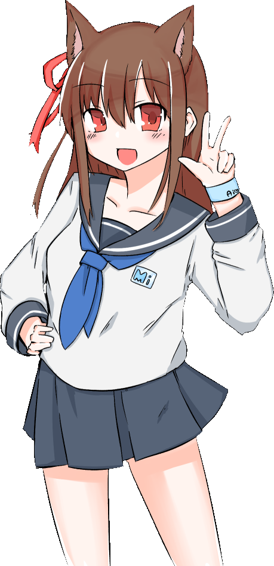

# Hej! 👋
---

るみさんだよ！/I'm a rumisan!/Я Румисан!
 
(日本人です)
C#とか、PHP とか JS とか、あと C++とかできます！
 
わたしの鯖/My Server/Мой сервер 
[るみ鯖](https://rumiserver.com) 
[るみあ](https://rumia.me) 
[まひろ](https://まひろ.net) 
[藍ちゃん](https://ai-chan-fan-site.me) 
 

↑ 詰め込めるものを全て詰め込んだやつ

